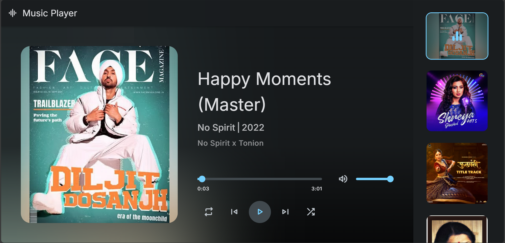

# CodeAlpha_task3
Music Player Project

Description

This is a simple Music Player Project built using JavaScript, HTML, and CSS. The architecture is divided into three main components:

HTML: Defines the structure of the music player.

CSS: Adds styling to enhance the user interface.

JavaScript: Handles functionality such as playing audio, managing player buttons, and displaying music information.

Features

Play, pause, and stop functionality

Next and previous track buttons

Displaying song title and artist information

Volume control

Progress bar to show playback time

Responsive design for different screen sizes

Technologies Used

HTML

CSS (Cascading Style Sheets)

JavaScript

## Screenshot of the web page

